### Hi there 👋

I'm a normal student majored in CS.

Loving writing codes or tools for interested games.

**Currently** interested in game localizations researching.

- Programming Languages (used but not skilled): C, C++, Python, C#, JS/TS, Java
- Languages: Chinese(R/W), English(R/W), Japanese(R)
- Skills: *NULL*
- Interested (or Learning): Reverse Engineering, Data Mining, Computer Graphics, Game Designing.

### *Some Links*
- [Twitter](https://twitter.com/sh0wer1ee)
- [Blog](https://sh0wer1ee.github.io/)

<b>*GitHub Stats*:</b> \
  
